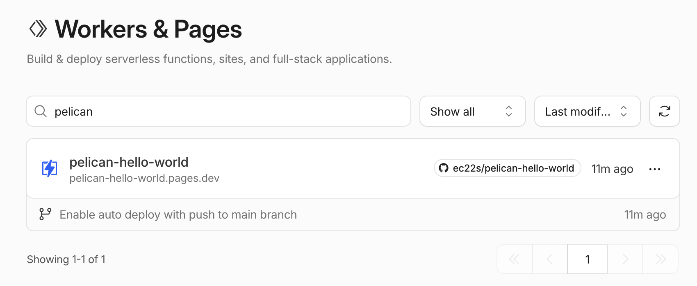

# pelican-hello-world

### GitHub Actions&thinsp;による&thinsp;Cloudflare Pages&thinsp;への自動デプロイ

#### 必要なもの

- Cloudflare&thinsp;アカウント（無料枠でも可）

  - ID&thinsp;控える（検索窓で&thinsp;Copy account ID&thinsp;）

  - Account API token&thinsp;を作成（Pages Write&thinsp;権限を付与）

- デプロイ先 = Cloudflare Pages&thinsp;のプロジェクト

  - 空の状態でもよいし、最初から&thinsp;GitHub&thinsp;リポジトリへ紐付け[（後述）](#Cloudflare%E3%81%8B%E3%82%89%E3%83%AA%E3%83%9D%E3%82%B8%E3%83%88%E3%83%AA%E3%81%B8%E7%B4%90%E4%BB%98%E3%81%91)してもよい

  - サブドメイン `****.pages.dev` は後から変えられない（2026年8月時点）

  - Pages&thinsp;を作るリンクが分かりにくい

    参考 https://cly7796.net/blog/other/publish-your-site-with-cloudflare-pages/

 

#### GitHub&thinsp;での設定

- リポジトリの&thinsp;Actions secrets and variables&thinsp;に下記を設定

  - Cloudflare&thinsp;の&thinsp;Account ID, Account API token

  - デプロイ先の&thinsp;Pages&thinsp;名

- 上記を使い&thinsp;GitHub Actions&thinsp;を作成

  本リポジトリの例 → [`.github/workflows/deploy.yml`](../.github/workflows/deploy.yml)

 

#### 本リポジトリの挙動

- GitHub Actions&thinsp;に設定したタイミングで以下の処理が走る

  - GitHub&thinsp;内で&thinsp;Docker&thinsp;コンテナが起動、Pelican&thinsp;が `project/output` に出力

  - `project/output` を&thinsp;Cloudflare Pages&thinsp;にデプロイ

 

#### Cloudflare からリポジトリへ紐付け

- GitHub&thinsp;の設定で、Cloudflare GitHub App&thinsp;がリポジトリにアクセス可能にする

- Cloudflare Pages&thinsp;の設定でリポジトリを選ぶ

  - Production Branch&thinsp;やビルド設定は無関係（GitHub Actions&thinsp;が静的ファイル群を送ってくるだけなので）

- しなくても&thinsp;GitHub Actions&thinsp;からデプロイできるが、Cloudflare&thinsp;の画面上はソース不明になってしまう. リポジトリ紐付けによって元ブランチやコミットも分かる

 

#### 補：Cloudflare からデプロイする場合（2026年8月）

- GitHub Actions&thinsp;を使わない（使えなくなった）場合のメモ

- Cloudflare Pages&thinsp;のビルド設定を下記にする

  `Framework preset` : None

  `Build command` : `pip install markdown pelican && pelican content`

  `Build output directory` : `/output`

  `Root directory` : `/project`（本リポジトリの場合。ここに `pelicanconf.py` や `content` がある）

  - Build command&thinsp;は&thinsp;Pages&thinsp;のランタイム次第だが、2026年8月はこれで動いた

- Branch control&thinsp;からデプロイ対象のブランチも選べる

- リポジトリへのコミットをトリガーに自動デプロイ可

- 手動デプロイも可（個々のデプロイ履歴から&thinsp;Retry deployment&thinsp;）

 

---